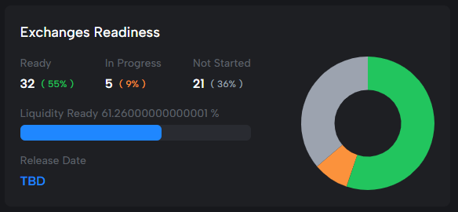

# Chang Upgrade #2 readiness


Intersect and the hard fork working group plays the role of coordinator, as a functional servant-leader on behalf of the community and delivery teams working on hard fork activity. The functional teams within Intersect will work with the various committees, working groups, and delivery teams, relaying information here on the knowledge base. Ultimately the date for the hard fork is directly influenced by the community, the relevant constitutional approval and required on-chain voting.


## Core Infrastructure Components 

Core infrastructure encompasses all technologies included within the Cardano Node, as well as some key tools.

<table><thead><tr><th width="197">Release</th><th></th></tr></thead><tbody><tr><td><a href="https://github.com/IntersectMBO/cardano-node/releases/tag/10.1.1">10.1.1</a></td><td>Node <code>10.1.1</code> is a mainnet release of the Cardano node that is capable of crossing the Chang#2 hard fork. It includes a number of improvements to the governance system, including support for SPO delegation to pre-defined voting options, and support for auto-abstain DRep votes supplanting abstaining via rewards address delegation. It also enables new Plutus primitives as defined in <a href="https://github.com/cardano-foundation/CIPs/tree/master/CIP-0122">CIP-0122</a>, <a href="https://github.com/cardano-foundation/CIPs/tree/master/CIP-0123">CIP-0123</a>, and <a href="https://github.com/cardano-foundation/CIPs/tree/master/CIP-0127">CIP-0127</a>.</td></tr></tbody></table>


Note that, although staking rewards will continue to be earned as usual, in order to withdraw their rewards, following the Chang#2 hard fork, Ada holders will need to delegate to a DRep, which may be one of the pre-defined options, a single key or a Plutus v3 script. Until the hard fork, rewards may be withdrawn normally. Although following the hard fork, rewards may not be withdrawn unless a DRep is delegated to, rewards will continue to accrue to the Ada holder normally, regardless of whether or not a DRep is delegated to.



There are a number of breaking changes, including changes to era-agnostic commands. The following are designated as legacy commands:

* `address` Payment address commands
* `stake-address` Stake address commands
* `key` Key utility commands
* `transaction` Transaction commands
* `node` Node operation commands
* `stake-pool` Stake pool commands
* `query` Node query commands. Will query the local node whose Unix domain socket is obtained from the `CARDANO_NODE_SOCKET_PATH` environment variable.
* `genesis` Genesis block commands
* `governance` Governance commands
* `text-view` Commands for dealing with Shelley TextView files. Transactions, addresses etc are stored on disk as TextView files.

For example, the previous top level commands `query` and `stake-pool` are now available as `latest query` and `latest stake-pool.`

Please read full release notes [here](https://github.com/IntersectMBO/cardano-node/releases/tag/10.1.1).


It is recommend testing and upgrades are carried out now in advance of pre-production and mainnet hard fork governance actions. Features are available for testing now on the above release and on the [SanchoNet ](https://sancho.network/)test environment.

***

## Readiness

Readiness is a self-attestation from the community and ecosystem, facilitated at Intersect, of being technically ready for the Chang upgrade #2. Signalling readiness is important, this allows the on-chain governance, SPOs and the ICC in the case of Chang upgrade #2, to make an informed decision voting for the governance action to enact the hard fork.

***

### Governance Actions

Governance actions need to be enacted/voted on-chain for the hard fork to take place, you can keep track of the applicable governance actions for Chang upgrade #2 below.

<table><thead><tr><th>Network</th><th>Action</th><th>Status</th><th width="195">Governance Actors</th><th>View via</th></tr></thead><tbody><tr><td><mark style="color:green;">Preview</mark></td><td><mark style="color:green;">PPU Cost Model</mark></td><td><mark style="color:green;">Enacted</mark></td><td>CC</td><td><a href="https://preview.cardanoscan.io/govAction/gov_action1rarl8newf7gsn03wl6gc9jhqsvr72autml4zz58xjq7y3mw2pw8sqsymael">CardanoScan</a></td></tr><tr><td><mark style="color:green;">Preview</mark></td><td><mark style="color:green;">Hard Fork</mark></td><td><mark style="color:green;">Enacted</mark></td><td>SPO's, CC</td><td><a href="https://preview.cardanoscan.io/govAction/gov_action1qjdwt4sjktagy4j4szgn8vpr6cx8lr9vdq7z0r8ethskytj9jtesqvrtlga">CardanoScan</a></td></tr><tr><td><mark style="color:green;">Pre-production</mark></td><td><mark style="color:green;">PPU Cost Model</mark></td><td><mark style="color:green;">Ratified</mark></td><td>CC</td><td><a href="https://preprod.cardanoscan.io/govAction/gov_action1k5hsy2yw8n5v0et524fz7nkap8qj09m5nckmxgycajlfszmyt4zsqp0n7ft?tab=action">CardanoScan</a></td></tr><tr><td><mark style="color:orange;">Pre-production</mark></td><td><mark style="color:orange;">Hard Fork</mark></td><td><mark style="color:orange;">On-Chain</mark></td><td>SPO's, CC</td><td><a href="https://preprod.cardanoscan.io/govAction/gov_action1eje876cdtrp94celmqsmvtpc0afrpkhfxzhaqayflg7l26h9v53qqnjsjww?tab=action">CardanoScan</a></td></tr><tr><td><mark style="color:orange;">Mainnet</mark></td><td><mark style="color:orange;">PPU Cost Model</mark></td><td><mark style="color:orange;">On-Chain</mark></td><td>CC</td><td><a href="https://cardanoscan.io/govAction/gov_action1k2jertppnnndejjcglszfqq4yzw8evzrd2nt66rr6rqlz54xp0zsq05ecsn">CardanoScan</a></td></tr><tr><td>Mainnet</td><td>Hard Fork</td><td>Pending</td><td>SPO's, CC</td><td></td></tr></tbody></table>

Status key

Enacted:

Ratified:

On Chan:

Metadata for all Intersect governance actions can be found here on the [Intersect Gitbook repository](https://github.com/IntersectMBO/governance-actions).

***

### SPOs

Stake pool operators should upgrade to a supported mainnet node 10.x version in readiness for the hard fork. Below we compare the prevalence of Cardano blocks created by Node versions.

<figure><figcaption>
Mainnet - Updated via <a href="https://pooltool.io/networkhealth">Pooltool.io</a> 13th November 2024
</figcaption></figure>

As of November 13th 2024, 17% of blocks created on mainnet where created using node 10.x version. Live data can be seen via tooling such as [Pooltool.io](https://pooltool.io/networkhealth)

{iframe}(https://api.clio.one/istoria/block-versions/)

***

### Tooling

Tooling readiness is supported from version Node 10.1.1 compatible releases.

**Libraries**

<table><thead><tr><th width="274">Library</th><th width="210">Status</th><th>Notes</th></tr></thead><tbody><tr><td>Cardano Serialization Library</td><td></td><td></td></tr><tr><td>Cardano Multiplatform Library</td><td></td><td></td></tr><tr><td>Cardano JavaScript SDK</td><td></td><td></td></tr><tr><td>Pallas</td><td></td><td></td></tr><tr><td>Cardano Transaction Library</td><td></td><td></td></tr><tr><td>MeshSDK</td><td></td><td></td></tr><tr><td>Aiken</td><td></td><td></td></tr></tbody></table>

**Tools**

<table><thead><tr><th width="274">Tools</th><th width="206">Status</th><th>Notes</th></tr></thead><tbody><tr><td>cardano-wallet</td><td></td><td></td></tr><tr><td>Rosetta</td><td></td><td></td></tr><tr><td>GraphQL</td><td></td><td></td></tr><tr><td>cntools (guild-operators)</td><td></td><td></td></tr><tr><td>SPO Scripts (@gitmachtl)</td><td></td><td></td></tr><tr><td>Ogmios</td><td></td><td></td></tr></tbody></table>

**Indexers**

<table><thead><tr><th width="282">Indexers</th><th width="208">Status</th><th>Notes</th></tr></thead><tbody><tr><td>Kupo</td><td></td><td></td></tr><tr><td>Oura</td><td></td><td></td></tr><tr><td>Scrolls</td><td></td><td></td></tr><tr><td>DB-Sync</td><td></td><td></td></tr><tr><td>Carp</td><td></td><td></td></tr></tbody></table>

**Higher Level Tooling**

<table><thead><tr><th width="284">Tools</th><th width="214">Status</th><th>Notes</th></tr></thead><tbody><tr><td>Blockfrost</td><td></td><td></td></tr><tr><td>Koios</td><td></td><td></td></tr><tr><td>Maestro</td><td></td><td></td></tr></tbody></table>

***

### Wallets

Wallet readiness is tracked against their integration against Cardano Node versions, as well as self-reported readiness

**Light Wallets**

<table><thead><tr><th width="232">Wallet</th><th width="286">Highlevel Status</th><th>Preview Network</th></tr></thead><tbody><tr><td>Begin</td><td></td><td></td></tr><tr><td>Eternl</td><td></td><td></td></tr><tr><td>Eternl (mobile)</td><td></td><td></td></tr><tr><td>Lace</td><td></td><td></td></tr><tr><td>Nami</td><td></td><td></td></tr><tr><td>Nufi</td><td></td><td></td></tr><tr><td>Vespr</td><td></td><td></td></tr><tr><td>Vespr (Mobile)</td><td></td><td></td></tr><tr><td>Tokeo</td><td></td><td></td></tr><tr><td>Yoroi</td><td></td><td></td></tr><tr><td>Yoroi (Mobile)</td><td></td><td></td></tr><tr><td>Gero</td><td></td><td></td></tr><tr><td>Gero Mobile</td><td></td><td></td></tr><tr><td>Typhon</td><td></td><td></td></tr><tr><td>Flint</td><td></td><td></td></tr></tbody></table>

**Hardware Wallets**

<table><thead><tr><th width="251">Wallet</th><th>Status</th><th>Notes</th></tr></thead><tbody><tr><td>Trezor</td><td></td><td></td></tr><tr><td>Ledger (Nano S+, Nano X, Stax)</td><td></td><td></td></tr><tr><td>Ledger (Nano S)</td><td></td><td></td></tr><tr><td>Keystone</td><td></td><td></td></tr></tbody></table>

#### Full Node / CLI Wallets

<table><thead><tr><th width="251">Wallet</th><th>Status</th><th>Notes</th></tr></thead><tbody><tr><td>Daedalus</td><td></td><td></td></tr><tr><td>AdaLite</td><td></td><td></td></tr><tr><td>CNTools</td><td></td><td></td></tr></tbody></table>

***

### DApps

DApp readiness will be reported shortly, once tooling readiness is demonstrated as underway. To help the ecosystem know your readiness and to participate in this attestation please head to the Intersect Discord wg-hard-fork channel.

***

Further readiness information will be published as it becomes available. Readiness updates on Environments, SPOs and Exchanges will be available soon.

If you find any information on this page incorrect or misleading please email hard-fork@intersectmbo.org and request a correction.
