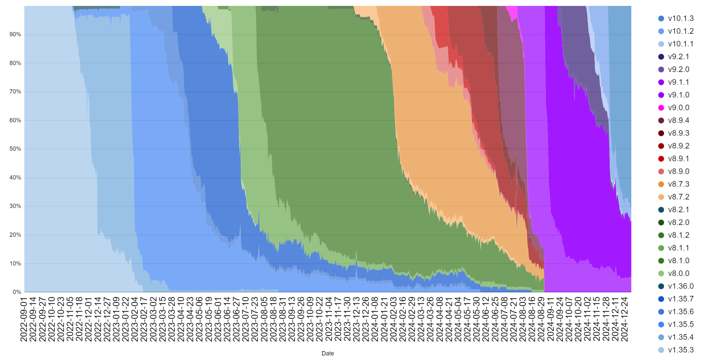

# Plomin upgrade readiness


Intersect and the hard fork working group plays the role of coordinator, as a functional servant-leader on behalf of the community and delivery teams working on hard fork activity. The functional teams within Intersect will work with the various committees, working groups, and delivery teams, relaying information here on the knowledge base. Ultimately the date for the hard fork is directly influenced by the community, the relevant constitutional approval and required on-chain voting.


## Core Infrastructure Components <a href="#core-infrastructure-components" id="core-infrastructure-components"></a>

Core infrastructure encompasses all technologies included within the Cardano Node, as well as some key tools.

<table><thead><tr><th width="197">Release</th><th></th></tr></thead><tbody><tr><td><a href="https://github.com/IntersectMBO/cardano-node/releases">10.1.3</a></td><td><p><em><strong>It is required that users upgrade to this version of the node.</strong></em></p><p>Node <code>10.1.3</code> is a mainnet-ready release of the Cardano node that is capable of crossing the Chang#2 hard fork. This update addresses a ledger issue where DRep delegations could be removed under some conditions. This inadvertently affected the ability to withdraw rewards in Protocol Version 10, and changed the stake distribution for some DReps.</p><p><strong>For further details about <code>cardano-node 10.1.3</code> please see the</strong> <a href="https://github.com/IntersectMBO/cardano-node/releases/tag/10.1.1"><strong>release notes for <code>10.1.1</code></strong></a><strong>, since significant upgrades were performed compared to previous versions of the node.</strong></p></td></tr></tbody></table>

### 10.1.3 Ledger replay in Preview and Pre-production

Due to the nature of [Issue #4772](https://github.com/IntersectMBO/cardano-ledger/issues/4772#issuecomment-2499160212) effect on hard forked networks running Protocol version 10.0, all nodes on testnets will require a re-synchronisation from genesis. This will not be required for mainnet, as it is yet to hard fork for Protocol version 10.0 (via Plomin).

Once upgraded to 10.1.3 in any testnet, the ledger directory can be deleted to force the node to resync the network from genesis. This will ensure that the node’s ledger state will be reconstructed correctly, without the effect of Issue #4772.


```
To perform ledger replay:
1.	Ensure the node version is updated to 10.1.3,
2.	Stop the node service (if running),
3.	Delete ledger state (path may vary by installation type, e.g.: $ rm /var/lib/cardano-node/db-$NETWORK/ledger/*),
4.	Restart the node service and the ledger replay from genesis will occur
```



To reiterate this step is not required for mainnet.


For support with this upgrade on testnets feel free to ask questions via discord at [#hfwg-plomin](https://discord.gg/Hxtz9f38Ep) on the Intersect server or #spo-testnet via the [IOHK server](https://discord.gg/inputoutput).

***


Note that, although staking rewards will continue to be earned as usual, in order to withdraw their rewards, following the Plomin hard fork, Ada holders will need to delegate to a DRep, which may be one of the pre-defined options, a single key or a Plutus v3 script. Until the hard fork, rewards may be withdrawn normally. Although following the hard fork, rewards may not be withdrawn unless a DRep is delegated to, rewards will continue to accrue to the Ada holder normally, regardless of whether or not a DRep is delegated to.


***

## Readiness and Updating this Page

Readiness is a self-attestation from the community and ecosystem, facilitated at Intersect, of being technically ready for the Plomin upgrade.

Signalling readiness is important, this allows the on-chain governance, SPOs and the ICC in the case of Plomin upgrade, to make an informed decision voting for the governance action to enact the hard fork.

The community is encouraged to participate in updating and maintaining the status’ and details contained within this ecosystem readiness page.

You can do so by suggesting updates via this Intersect [GitHub documentation repository](https://github.com/IntersectMBO/hf-wg-documentation), a simple how to guide provided [here](../../).\
\
Alternatively, if you find any information on this page incorrect or misleading please email: hard-fork@intersectmbo.org and request an update or correction.

***

### Governance Actions

Governance actions need to be enacted/voted on-chain for the hard fork to take place, you can keep track of the applicable governance actions for Plomin upgrade below.

<table><thead><tr><th width="167">Network</th><th width="130">Action</th><th width="104">Status</th><th width="195">Governance Actors</th><th>View via</th></tr></thead><tbody><tr><td><mark style="color:green;">Preview</mark></td><td><mark style="color:green;">PPU Cost Model</mark></td><td><mark style="color:green;">Enacted</mark></td><td>CC</td><td><a href="https://preview.cardanoscan.io/govAction/gov_action1rarl8newf7gsn03wl6gc9jhqsvr72autml4zz58xjq7y3mw2pw8sqsymael">CardanoScan</a></td></tr><tr><td><mark style="color:green;">Preview</mark></td><td><mark style="color:green;">Hard Fork</mark></td><td><mark style="color:green;">Enacted</mark></td><td>SPO's, CC</td><td><a href="https://preview.cardanoscan.io/govAction/gov_action1qjdwt4sjktagy4j4szgn8vpr6cx8lr9vdq7z0r8ethskytj9jtesqvrtlga">CardanoScan</a></td></tr><tr><td><mark style="color:green;">Pre-production</mark></td><td><mark style="color:green;">PPU Cost Model</mark></td><td><mark style="color:green;">Enacted</mark></td><td>CC</td><td><a href="https://preprod.cardanoscan.io/govAction/gov_action1k5hsy2yw8n5v0et524fz7nkap8qj09m5nckmxgycajlfszmyt4zsqp0n7ft?tab=action">CardanoScan</a></td></tr><tr><td><mark style="color:green;">Pre-production</mark></td><td><mark style="color:green;">Hard Fork</mark></td><td><mark style="color:green;">Enacted</mark></td><td>SPO's, CC</td><td><a href="https://preprod.cardanoscan.io/govAction/gov_action1eje876cdtrp94celmqsmvtpc0afrpkhfxzhaqayflg7l26h9v53qqnjsjww?tab=action">CardanoScan</a></td></tr><tr><td><mark style="color:green;">Mainnet</mark></td><td><mark style="color:green;">PPU Cost Model</mark></td><td><mark style="color:green;">Enacted</mark></td><td>CC</td><td><a href="https://cardanoscan.io/govAction/gov_action1k2jertppnnndejjcglszfqq4yzw8evzrd2nt66rr6rqlz54xp0zsq05ecsn">CardanoScan</a></td></tr><tr><td>Mainnet</td><td>Hard Fork</td><td>On-chain</td><td>SPO's, CC</td><td><a href="https://cardanoscan.io/govAction/gov_action1pvv5wmjqhwa4u85vu9f4ydmzu2mgt8n7et967ph2urhx53r70xusqnmm525">CardanoScan</a></td></tr></tbody></table>

<details>

<summary><strong>Status key</strong></summary>

**Enacted**: Governance action has been applied on chain

**Ratified**: Governance action has reached required voting thresholds, and will normally be enacted next epoch

**Expired** - Governance action has failed to reach the required thresholds

**On-Chain** - governance action has been submitted to the blockchain and is available for voting

**Pending** - Governance action has not yet been submitted to the blockchain

</details>

Metadata for all Intersect governance actions can be found here on the [Intersect Gitbook repository](https://github.com/IntersectMBO/governance-actions).

***

### SPOs

Stake pool operators should upgrade to a supported mainnet node 10.1 version in readiness for the hard fork. Below we compare the prevalence of Cardano blocks created by Node versions.


<figure><figcaption><p>Block production version metrics via <a href="https://pooltool.io/networkhealth">PoolTool.io</a></p></figcaption></figure>

As of January 3rd, 2025, 79% of blocks created on mainnet where created using node 10.1+ version (updated to state the 10.1 version now required for mainnet hard fork).\
Live data can be seen via [Cardano explorers](https://explorer.cardano.org/) such as [Pooltool.io](https://pooltool.io/networkhealth)

Graph Showing Node Version adoption, up to 2025-01-03. [Via Markus](https://x.com/C1cADA_Markus/status/1867100795709141113/photo/1) on X ([@C1cADA\_Markus](https://x.com/C1cADA_Markus)).

<figure><figcaption></figcaption></figure>

***

### Tooling

Tooling readiness is supported from version Node 10.1.1 compatible releases. Where known release repositories have been added to the Notes section.

**Tools**

<table><thead><tr><th width="274">Tools</th><th width="206">Status</th><th>Notes</th></tr></thead><tbody><tr><td>cardano-wallet</td><td></td><td>(<a href="https://github.com/cardano-foundation/cardano-wallet/releases">release repository</a>)</td></tr><tr><td>Rosetta</td><td><mark style="color:green;">Ready Cardano Rosetta 2.4.2</mark></td><td>(<a href="https://github.com/cardano-foundation/cardano-rosetta/releases">release repository</a>)</td></tr><tr><td>GraphQL</td><td><mark style="color:green;">Ready Cardano GraphQL 8.3.2</mark></td><td>(<a href="https://github.com/cardano-foundation/cardano-graphql/releases">release repository</a>)</td></tr><tr><td>cntools (guild-operators)</td><td><mark style="color:green;">Ready CNTools 13.3.0</mark></td><td>(<a href="https://github.com/cardano-community/guild-operators/blob/alpha/docs/Scripts/cntools-changelog.md">change log</a>)</td></tr><tr><td>SPO Scripts (@gitmachtl)</td><td><mark style="color:green;">Ready</mark> <a href="https://github.com/gitmachtl/scripts/releases/tag/9.1.0-mainnet">9.1.0-mainnet</a></td><td>(<a href="https://github.com/gitmachtl/scripts/tags">release repository</a>)</td></tr><tr><td>Ogmios</td><td><mark style="color:green;">Ready</mark> <a href="https://github.com/CardanoSolutions/ogmios/releases/tag/v6.10.0"><mark style="color:green;">v6.10.0</mark></a></td><td>(<a href="https://github.com/CardanoSolutions/ogmios/releases">release repository</a>)</td></tr></tbody></table>

**Libraries**

<table><thead><tr><th width="287">Library</th><th width="210">Status</th><th>Notes</th></tr></thead><tbody><tr><td>Cardano Serialization Library</td><td><mark style="color:green;">Ready</mark></td><td>(<a href="https://github.com/Emurgo/cardano-serialization-lib/releases">release repository</a>)</td></tr><tr><td>Cardano Multiplatform Library</td><td><mark style="color:green;">Ready</mark></td><td>(<a href="https://github.com/dcSpark/cardano-multiplatform-lib/releases">release repository</a>)</td></tr><tr><td>Cardano JavaScript SDK</td><td><mark style="color:green;">Ready</mark></td><td>(<a href="https://github.com/input-output-hk/cardano-js-sdk/releases">release repository</a>)</td></tr><tr><td>Pallas</td><td><mark style="color:green;">Ready</mark></td><td>(<a href="https://github.com/txpipe/pallas/releases">release repository</a>)</td></tr><tr><td>Cardano Transaction Library</td><td><mark style="color:green;">Ready</mark></td><td>(<a href="https://github.com/Plutonomicon/cardano-transaction-lib/">release repository</a>)</td></tr><tr><td>MeshSDK</td><td><mark style="color:green;">Ready</mark></td><td>(<a href="https://github.com/MeshJS/mesh/releases">release repository</a>)</td></tr><tr><td>Aiken</td><td></td><td>(<a href="https://github.com/aiken-lang/aiken/releases">release repository</a>)</td></tr><tr><td>Lucid Evolution</td><td><mark style="color:green;">Ready</mark></td><td>(<a href="https://github.com/Anastasia-Labs/lucid-evolution/releases">release repository</a>)</td></tr></tbody></table>

**Indexers**

<table><thead><tr><th width="282">Indexers</th><th width="208">Status</th><th>Notes</th></tr></thead><tbody><tr><td>Kupo</td><td><mark style="color:green;">Ready</mark></td><td>(<a href="https://github.com/CardanoSolutions/kupo/releases">release repository</a>)</td></tr><tr><td>Oura</td><td></td><td>(<a href="https://github.com/txpipe/oura/releases">release repository</a>)</td></tr><tr><td>Scrolls</td><td></td><td>(<a href="https://github.com/txpipe/scrolls/releases">release repository</a>)</td></tr><tr><td>DB-Sync</td><td><mark style="color:green;">Ready DB Sync 13.6.0.4</mark></td><td>(<a href="https://github.com/IntersectMBO/cardano-db-sync/releases/tag/13.6.0.4">release repository</a>)</td></tr><tr><td>Carp</td><td><mark style="color:green;">Ready</mark></td><td>(<a href="https://github.com/dcSpark/carp/releases">release repository</a>)</td></tr></tbody></table>

**Higher Level Tooling**

<table><thead><tr><th width="284">Tools</th><th width="214">Status</th><th>Notes</th></tr></thead><tbody><tr><td>Blockfrost</td><td><mark style="color:green;">Ready</mark></td><td>(<a href="https://github.com/blockfrost">repository</a>)</td></tr><tr><td>Koios</td><td><mark style="color:green;">Ready</mark></td><td>(<a href="https://github.com/cardano-community/koios-artifacts/releases">release repository</a>)</td></tr><tr><td>Maestro</td><td></td><td>(<a href="https://github.com/maestro-org">repository</a>)</td></tr></tbody></table>

***

### Wallets

Wallet readiness is tracked against their integration against Cardano Node versions, as well as self-reported readiness

**Light Wallets**

<table><thead><tr><th width="232">Wallet</th><th width="286">Highlevel Status</th><th>Notes</th></tr></thead><tbody><tr><td>Eternl</td><td><mark style="color:green;">Ready</mark></td><td>Web: >= 1.12.19<br>Extension: >= 1.12.19</td></tr><tr><td>Eternl (mobile)</td><td><mark style="color:green;">Ready</mark></td><td>Android (app): >= 1.12.19<br>Android (PWA): >= 1.12.19<br>iOS (app): >=1.12.19<br>iOS (PWA): >=1.12.19</td></tr><tr><td>Lace</td><td><mark style="color:green;">Ready</mark></td><td>(from <a href="https://x.com/lace_io/status/1861767276522774669">Lace 1.17.5</a>)</td></tr><tr><td>Nami</td><td><mark style="color:green;">Ready</mark></td><td>(from <a href="https://iohk.zendesk.com/hc/en-us/articles/37066413506969-Nami-3-8-0-Release-notes">Nami 3.8.0</a>)</td></tr><tr><td>Nufi</td><td><mark style="color:green;">Ready</mark></td><td></td></tr><tr><td>Vespr</td><td></td><td></td></tr><tr><td>Tokeo</td><td></td><td></td></tr><tr><td>Yoroi</td><td><mark style="color:green;">Ready</mark></td><td>(from <a href="https://x.com/YoroiWallet/status/1848411193196613681">Yoroi</a><a href="https://x.com/YoroiWallet/status/1848450503858110869"> 5.0</a>)</td></tr><tr><td>Gero</td><td><mark style="color:green;">Ready</mark></td><td>(<a href="https://chromewebstore.google.com/detail/gero-dashboard-beta/iifeegfcfhlhhnilhfoeihllenamcfgc">Release notes</a>)</td></tr><tr><td>Typhon</td><td><mark style="color:green;">Ready</mark></td><td>(from release v3.2)</td></tr><tr><td>Flint</td><td><mark style="color:orange;">Won't progress</mark> (<a href="https://x.com/FlintWallet/status/1828184961960308832?t=0eIBBMnAY5feMTOlojFlSg&#x26;s=19">X post</a>)</td><td><mark style="color:orange;">Won't progress</mark> (<a href="https://x.com/FlintWallet/status/1828184961960308832?t=0eIBBMnAY5feMTOlojFlSg&#x26;s=19">X post</a>)</td></tr></tbody></table>

**Hardware Wallets**

<table><thead><tr><th width="251">Wallet</th><th>Status</th><th>Notes</th></tr></thead><tbody><tr><td>Trezor</td><td><mark style="color:green;">Ready</mark></td><td></td></tr><tr><td>Ledger</td><td><mark style="color:green;">Ready</mark></td><td>(<a href="https://x.com/ATADA_Stakepool/status/1828788278373548248">announcement</a>)</td></tr><tr><td>Keystone</td><td><mark style="color:green;">Ready</mark></td><td>(<a href="https://x.com/KeystoneWallet/status/1823019121157750946">from v1.6.0</a>)</td></tr></tbody></table>

#### Full Node / CLI Wallets

<table><thead><tr><th width="251">Wallet</th><th>Status</th><th>Notes</th></tr></thead><tbody><tr><td>Daedalus</td><td><mark style="color:green;">Ready</mark></td><td>(from <a href="https://github.com/input-output-hk/daedalus/releases">release 7.0.0</a>)</td></tr><tr><td>AdaLite</td><td><mark style="color:green;">Ready</mark></td><td></td></tr><tr><td>CNTools</td><td><mark style="color:green;">Ready</mark></td><td>(<a href="https://github.com/cardano-community/guild-operators/blob/alpha/docs/Scripts/cntools-changelog.md">from release 13.3.0</a>)</td></tr></tbody></table>

***

### DApps & Projects

DApp and project readiness is tracked against self reported readiness. Although this hard fork will remain in the Conway era DApp developers should refer to the [release notes](https://github.com/IntersectMBO/cardano-node/releases) and confirm readiness for the intra-era hard fork.

| Name          | Status |
| ------------- | ------ |
| Asda Finance  |        |
| Astarter      |        |
| Axo           |        |
| Book.io       |        |
| Cerra         |        |
| Charli3       |        |
| CherryLend    |        |
| Clarity       |        |
| Comment       |        |
| Danogo        | Ready  |
| DexHunter     |        |
| Encoins       |        |
| Fluid Tokens  | Ready  |
| Genius Yield  | Ready  |
| Iagon         |        |
| JPG.Store     |        |
| Lending Pond  |        |
| Lenfi         |        |
| Levvy Finance |        |
| Moneta        |        |
| MuseliSwap    |        |
| MyUSD         |        |
| NEWM          |        |
| NMKR          |        |
| Optim         |        |
| Orcfax        |        |
| Revuto        |        |
| Rosenbridge   |        |
| Saturn Swap   |        |
| Snekdotfun    | Ready  |
| Spectrum      |        |
| Splash        | Ready  |
| Summon        | Ready  |
| Tempo         | Ready  |
| TeddySwap     |        |
| USDM          |        |
| VyFinance     |        |
| Wingriders    |        |

***


The community is encouraged to participate in updating and maintaining the status’ and details contained within this ecosystem readiness page.

You can do so by suggesting updates via this Intersect [GitHub documentation repository](https://github.com/IntersectMBO/hf-wg-documentation), a simple how to guide provided [here](../../).\
\
Alternatively, if you find any information on this page incorrect or misleading please email hard-fork@intersectmbo.org and request an update or correction.

