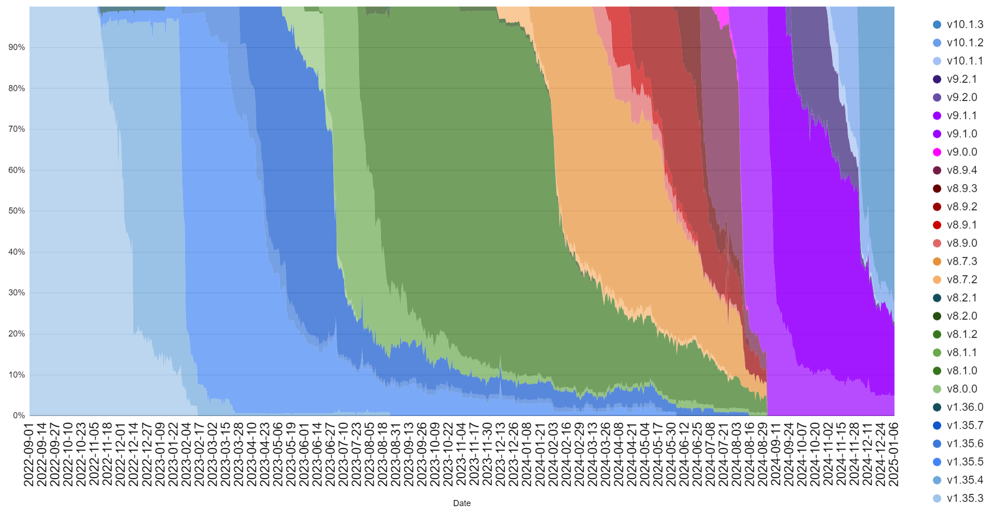

# Plomin upgrade readiness


Intersect and the hard fork working group plays the role of coordinator, as a functional servant-leader on behalf of the community and delivery teams working on hard fork activity. The functional teams within Intersect will work with the various committees, working groups, and delivery teams, relaying information here on the knowledge base. Ultimately the date for the hard fork is directly influenced by the community, the relevant constitutional approval and required on-chain voting.



See anything missing or incorrect on this page? - please email **hard-fork@intersectmbo.org** or raise an issue via [Github/HF-WG-Documentation](https://github.com/IntersectMBO/hf-wg-documentation/issues/new) (or pull request - [see how-to](https://github.com/IntersectMBO/hf-wg-documentation?tab=readme-ov-file#chang-2-updating-tooling-readiness))

**This page is frequently updated and was last updated 01/22/2025**


## Core Infrastructure Components 

Core infrastructure encompasses all technologies included within the Cardano Node, as well as some key tools.

<table><thead><tr><th width="197">Release</th><th></th></tr></thead><tbody><tr><td><a href="https://github.com/IntersectMBO/cardano-node/releases/tag/10.1.4">10.1.4</a></td><td>
<strong>It is required that all Cardano stake pools and relays upgrade to this node version in order to mitigate a potential DoS attack following a hard fork to Protocol Version 10 ("Plomin" hard fork on mainnet). It is recommended that all other node users upgrade to this version. Node users who do not upgrade put themselves at risk of a potential DoS attack following the hard fork.</strong>

Node <code>10.1.4</code> is a mainnet-ready release of the Cardano node that is capable of crossing the Chang#2 ("Plomin") hard fork. It adds safeguards at the mempool level to block specific types of transaction that could lead to a DoS attack following the hard fork.

<strong>For further details about <code>cardano-node 10.1.4</code> please see the release notes for node versions</strong> <a href="https://github.com/IntersectMBO/cardano-node/releases/tag/10.1.1"><strong><code>10.1.1</code></strong></a><strong>,</strong> <a href="https://github.com/IntersectMBO/cardano-node/releases/tag/10.1.2"><strong><code>10.1.2</code></strong></a> <strong>and</strong> <a href="https://github.com/IntersectMBO/cardano-node/releases/tag/10.1.3"><strong><code>10.1.3</code></strong></a><strong>.</strong>
</td></tr></tbody></table>


Note that, although staking rewards will continue to be earned as usual, in order to withdraw their rewards, following the Plomin hard fork, Ada holders will need to delegate to a DRep, which may be one of the pre-defined options, a single key or a Plutus v3 script. Until the hard fork, rewards may be withdrawn normally. Although following the hard fork, rewards may not be withdrawn unless a DRep is delegated to, rewards will continue to accrue to the Ada holder normally, regardless of whether or not a DRep is delegated to.


***

## Readiness and Updating this Page

Readiness is a self-attestation from the community and ecosystem, facilitated at Intersect, of being technically ready for the Plomin upgrade.

Signalling readiness is important, this allows the on-chain governance, SPOs and the ICC in the case of Plomin upgrade, to make an informed decision voting for the governance action to enact the hard fork.

The community is encouraged to participate in updating and maintaining the status’ and details contained within this ecosystem readiness page.

You can do so by suggesting updates via this Intersect [GitHub documentation repository](https://github.com/IntersectMBO/hf-wg-documentation), a simple how to guide provided [here](../../../).\
\
Alternatively, if you find any information on this page incorrect or misleading please email: hard-fork@intersectmbo.org and request an update or correction.

***

### Governance Actions

Governance actions need to be enacted/voted on-chain for the hard fork to take place, you can keep track of the applicable governance actions for Plomin upgrade below.

<table><thead><tr><th width="167">Network</th><th width="130">Action</th><th width="104">Status</th><th width="195">Governance Actors</th><th>View via</th></tr></thead><tbody><tr><td><mark style="color:green;">Preview</mark></td><td><mark style="color:green;">PPU Cost Model</mark></td><td><mark style="color:green;">Enacted</mark></td><td>CC</td><td><a href="https://preview.cardanoscan.io/govAction/gov_action1rarl8newf7gsn03wl6gc9jhqsvr72autml4zz58xjq7y3mw2pw8sqsymael">CardanoScan</a></td></tr><tr><td><mark style="color:green;">Preview</mark></td><td><mark style="color:green;">Hard Fork</mark></td><td><mark style="color:green;">Enacted</mark></td><td>SPO's, CC</td><td><a href="https://preview.cardanoscan.io/govAction/gov_action1qjdwt4sjktagy4j4szgn8vpr6cx8lr9vdq7z0r8ethskytj9jtesqvrtlga">CardanoScan</a></td></tr><tr><td><mark style="color:green;">Pre-production</mark></td><td><mark style="color:green;">PPU Cost Model</mark></td><td><mark style="color:green;">Enacted</mark></td><td>CC</td><td><a href="https://preprod.cardanoscan.io/govAction/gov_action1k5hsy2yw8n5v0et524fz7nkap8qj09m5nckmxgycajlfszmyt4zsqp0n7ft?tab=action">CardanoScan</a></td></tr><tr><td><mark style="color:green;">Pre-production</mark></td><td><mark style="color:green;">Hard Fork</mark></td><td><mark style="color:green;">Enacted</mark></td><td>SPO's, CC</td><td><a href="https://preprod.cardanoscan.io/govAction/gov_action1eje876cdtrp94celmqsmvtpc0afrpkhfxzhaqayflg7l26h9v53qqnjsjww?tab=action">CardanoScan</a></td></tr><tr><td><mark style="color:green;">Mainnet</mark></td><td><mark style="color:green;">PPU Cost Model</mark></td><td><mark style="color:green;">Enacted</mark></td><td>CC</td><td><a href="https://cardanoscan.io/govAction/gov_action1k2jertppnnndejjcglszfqq4yzw8evzrd2nt66rr6rqlz54xp0zsq05ecsn">CardanoScan</a></td></tr><tr><td>Mainnet</td><td>Hard Fork</td><td>On-chain</td><td>SPO's, CC</td><td><a href="https://cardanoscan.io/govAction/gov_action1pvv5wmjqhwa4u85vu9f4ydmzu2mgt8n7et967ph2urhx53r70xusqnmm525">CardanoScan</a></td></tr></tbody></table>

<strong>Status key</strong>

**Enacted**: Governance action has been applied on chain

**Ratified**: Governance action has reached required voting thresholds, and will normally be enacted next epoch

**Expired** - Governance action has failed to reach the required thresholds

**On-Chain** - governance action has been submitted to the blockchain and is available for voting

**Pending** - Governance action has not yet been submitted to the blockchain

Metadata for all Intersect governance actions can be found here on the [Intersect Gitbook repository](https://github.com/IntersectMBO/governance-actions).

***

### Plomin Hardfork Action Vote Totals

Stake Pool Operators

Below is SPO vote totals for the Plomin Hardfork Initiation governance action, data provided via [Koios](https://koios.rest/).

**Summary**

The stake pool vote threshold to reach is 51% of total stake to vote yes.

|                | Percentage of stake |
| -------------- | ------------------- |
| Yes            | 67.88%               |
| No + Not Voted | 32.12%               |

SPO vote summary last updated: 2025-02-03 00:09:04

**Details**

|    Vote   | Total Number | Total Stake Represented |
| :-------: | :----------: | :---------------------: |
|    Yes    |      396     |          7.06b          |
|     No    |       4      |          60.79m         |
|  Abstain  |       2      |          38.98m         |
| Not Voted | 2082       | 7.32b  |

SPO vote total last updated: 2025-02-03 00:09:04

#### Interim Constitutional Committee

Below is ICC vote totals for the Plomin Hardfork Initiation governance action, data provided via [Koios](https://koios.rest/).

The constitutional committee vote threshold to reach is 5 out of 7 constitutional votes (> 66.6%).

|       Vote       | Total | Percentage |
| :--------------: | :---: | :--------: |
|  Constitutional  |   0   |     0%     |
| Unconstitutional | 0     | 0%     |
|      Abstain     |   0   |     0%     |
|     Not voted    |   7   |    100%    |

ICC vote total last updated: 2025-02-03 00:09:04

***

### SPOs

Stake pool operators should upgrade to a supported mainnet node 10.1.4 version in readiness for the hard fork. Below we compare the prevalence of Cardano blocks created by Node versions.

<figure><figcaption></figcaption></figure>

As of January 22nd, 2025: 89% of blocks created on mainnet, within the current epoch, where created using the hotfixed 10.1.4 version (which reports as 10.2)\
Live data can be seen via [Cardano explorers](https://explorer.cardano.org/) such as [Pooltool.io](https://pooltool.io/networkhealth)

Graph Showing Node Version adoption, up to 2025-01-07. [Via Markus](https://x.com/C1cADA_Markus/status/1867100795709141113/photo/1) on X ([@C1cADA\_Markus](https://x.com/C1cADA_Markus)).

<figure><figcaption></figcaption></figure>

***

### Exchanges

Exchange readiness is tracked against the top exchanges by ADA liquidity (as reported by [Cexplorer/hfs](https://cexplorer.io/hfs)).

For the latest info on _Exchanges by Liquidity_ please visit: [Cardanoscan](https://cardanoscan.io/changreadiness) (source) and [Cexplorer](https://cexplorer.io/hfs).

<figure><figcaption></figcaption></figure>

As of January 22nd, 2025, 84.5 % of exchange liquidity has been reported as Ready for Plomin hard fork.

***

### Tooling

Tooling readiness is supported from version Node 10.1.1 compatible releases. Where known release repositories have been added to the Notes section.

**Tools**

<table><thead><tr><th width="274">Tools</th><th width="206">Status</th><th>Notes</th></tr></thead><tbody><tr><td>cardano-wallet</td><td><mark style="color:green;">Ready</mark></td><td>(<a href="https://github.com/cardano-foundation/cardano-wallet/releases">release repository</a>)</td></tr><tr><td>Rosetta</td><td><mark style="color:green;">Ready</mark></td><td>(<a href="https://github.com/cardano-foundation/cardano-rosetta/releases">release repository</a>)</td></tr><tr><td>Rosetta-Java</td><td><mark style="color:green;">Ready</mark></td><td>(<a href="https://github.com/cardano-foundation/cardano-rosetta-java/releases/tag/1.1.5">release repository</a>)</td></tr><tr><td>GraphQL</td><td><mark style="color:green;">Ready</mark></td><td>(<a href="https://github.com/cardano-foundation/cardano-graphql/releases">release repository</a>)</td></tr><tr><td>cntools (guild-operators)</td><td><mark style="color:green;">Ready CNTools 13.3.0</mark></td><td>(<a href="https://github.com/cardano-community/guild-operators/blob/alpha/docs/Scripts/cntools-changelog.md">change log</a>)</td></tr><tr><td>SPO Scripts (@gitmachtl)</td><td><mark style="color:green;">Ready</mark> <a href="https://github.com/gitmachtl/scripts/releases/tag/10.1.4-mainnet">10.1.4-mainnet</a></td><td>(<a href="https://github.com/gitmachtl/scripts/releases">release repository</a>)</td></tr><tr><td>Ogmios</td><td><mark style="color:green;">Ready</mark> <a href="https://github.com/CardanoSolutions/ogmios/releases/tag/v6.10.0"><mark style="color:green;">v6.10.0</mark></a></td><td>(<a href="https://github.com/CardanoSolutions/ogmios/releases">release repository</a>)</td></tr></tbody></table>

**Libraries**

<table><thead><tr><th width="287">Library</th><th width="210">Status</th><th>Notes</th></tr></thead><tbody><tr><td>Blaze Cardano</td><td><mark style="color:green;">Ready</mark></td><td>(<a href="https://github.com/butaneprotocol/blaze-cardano/releases">release repository</a>)</td></tr><tr><td>Cardano Serialization Library</td><td><mark style="color:green;">Ready</mark></td><td>(<a href="https://github.com/Emurgo/cardano-serialization-lib/releases">release repository</a>)</td></tr><tr><td>Cardano Multiplatform Library</td><td><mark style="color:green;">Ready</mark></td><td>(<a href="https://github.com/dcSpark/cardano-multiplatform-lib/releases">release repository</a>)</td></tr><tr><td>Cardano JavaScript SDK</td><td><mark style="color:green;">Ready</mark></td><td>(<a href="https://github.com/input-output-hk/cardano-js-sdk/releases">release repository</a>)</td></tr><tr><td>Pallas</td><td><mark style="color:green;">Ready</mark></td><td>(<a href="https://github.com/txpipe/pallas/releases">release repository</a>)</td></tr><tr><td>Cardano Transaction Library</td><td><mark style="color:green;">Ready</mark></td><td>(<a href="https://github.com/Plutonomicon/cardano-transaction-lib/">release repository</a>)</td></tr><tr><td>MeshSDK</td><td><mark style="color:green;">Ready</mark></td><td>(<a href="https://github.com/MeshJS/mesh/releases">release repository</a>)</td></tr><tr><td>Aiken</td><td></td><td>(<a href="https://github.com/aiken-lang/aiken/releases">release repository</a>)</td></tr><tr><td>Lucid Evolution</td><td><mark style="color:green;">Ready</mark></td><td>(<a href="https://github.com/Anastasia-Labs/lucid-evolution/releases">release repository</a>)</td></tr></tbody></table>

**Indexers**

<table><thead><tr><th width="282">Indexers</th><th width="208">Status</th><th>Notes</th></tr></thead><tbody><tr><td>Kupo</td><td><mark style="color:green;">Ready</mark></td><td>(<a href="https://github.com/CardanoSolutions/kupo/releases">release repository</a>)</td></tr><tr><td>Oura</td><td><mark style="color:green;">Ready</mark></td><td>(<a href="https://github.com/txpipe/oura/releases">release repository</a>)</td></tr><tr><td>Scrolls</td><td><mark style="color:green;">Ready</mark></td><td>(<a href="https://github.com/txpipe/scrolls/releases">release repository</a>)</td></tr><tr><td>DB-Sync</td><td><mark style="color:green;">Ready DB Sync 13.6.0.4</mark></td><td>(<a href="https://github.com/IntersectMBO/cardano-db-sync/releases/tag/13.6.0.4">release repository</a>)</td></tr><tr><td>Carp</td><td><mark style="color:green;">Ready</mark></td><td>(<a href="https://github.com/dcSpark/carp/releases">release repository</a>)</td></tr></tbody></table>

**Higher Level Tooling**

<table><thead><tr><th width="284">Tools</th><th width="214">Status</th><th>Notes</th></tr></thead><tbody><tr><td>Blockfrost</td><td><mark style="color:green;">Ready</mark></td><td>(<a href="https://github.com/blockfrost">repository</a>)</td></tr><tr><td>Koios</td><td><a href="https://cardanoscan.io/transactions?address=61ce86e21b7aec342cc3ee19dcf6538fbbabec4f1d07c0064a69df6c34"><mark style="color:green;">Ready</mark></a></td><td>(<a href="https://github.com/cardano-community/koios-artifacts/releases">release repository</a>)</td></tr><tr><td>Maestro</td><td><a href="https://cardanoscan.io/transactions?address=61ce86e21b7aec342cc3ee19dcf6538fbbabec4f1d07c0064a69df6c34"><mark style="color:green;">Ready</mark></a></td><td>(<a href="https://github.com/maestro-org">repository</a>)</td></tr></tbody></table>

***

### Wallets

Wallet readiness is tracked against their integration against Cardano Node versions, as well as self-reported readiness

**Light Wallets**

<table><thead><tr><th width="232">Wallet</th><th width="286">Highlevel Status</th><th>Notes</th></tr></thead><tbody><tr><td>Eternl</td><td><mark style="color:green;">Ready</mark></td><td></td></tr><tr><td>Eternl (mobile)</td><td><mark style="color:green;">Ready</mark></td><td>Android app ready, Apple app awaiting app store approval</td></tr><tr><td>Lace</td><td><mark style="color:green;">Ready</mark></td><td></td></tr><tr><td>Nufi</td><td><mark style="color:green;">Ready</mark></td><td></td></tr><tr><td>MinWallet</td><td><mark style="color:green;">Ready</mark></td><td></td></tr><tr><td>Vespr</td><td></td><td></td></tr><tr><td>Tokeo</td><td></td><td></td></tr><tr><td>Yoroi</td><td><mark style="color:green;">Ready</mark></td><td></td></tr><tr><td>Typhon</td><td><mark style="color:green;">Ready</mark></td><td></td></tr><tr><td>Nami</td><td><mark style="color:orange;">Won't progress</mark></td><td>See <a href="https://www.lace.io/blog/a-guide-to-laces-new-nami-mode">blog post</a></td></tr><tr><td>Flint</td><td><mark style="color:orange;">Won't progress</mark></td><td>See <a href="https://x.com/FlintWallet/status/1828184961960308832?t=0eIBBMnAY5feMTOlojFlSg&#x26;s=19">X post</a></td></tr></tbody></table>

**Hardware Wallets**

<table><thead><tr><th width="251">Wallet</th><th>Status</th><th>Notes</th></tr></thead><tbody><tr><td>Trezor</td><td><mark style="color:green;">Ready</mark></td><td></td></tr><tr><td>Ledger</td><td><mark style="color:green;">Ready</mark></td><td>(<a href="https://x.com/ATADA_Stakepool/status/1828788278373548248">announcement</a>)</td></tr><tr><td>Keystone</td><td><mark style="color:green;">Ready</mark></td><td>(<a href="https://x.com/KeystoneWallet/status/1823019121157750946">from v1.6.0</a>)</td></tr></tbody></table>

#### Full Node / CLI Wallets

<table><thead><tr><th width="251">Wallet</th><th>Status</th><th>Notes</th></tr></thead><tbody><tr><td>Daedalus</td><td><mark style="color:green;">Ready</mark></td><td>(from <a href="https://github.com/input-output-hk/daedalus/releases">release 7.0.0</a>)</td></tr><tr><td>AdaLite</td><td><mark style="color:green;">Ready</mark></td><td></td></tr><tr><td>CNTools</td><td><mark style="color:green;">Ready</mark></td><td>(<a href="https://github.com/cardano-community/guild-operators/blob/alpha/docs/Scripts/cntools-changelog.md">from release 13.3.0</a>)</td></tr></tbody></table>

***

### DApps & Projects

DApp and project readiness is tracked against self reported readiness. Although this hard fork will remain in the Conway era DApp developers should refer to the latest [release notes](https://github.com/IntersectMBO/cardano-node/releases) and confirm readiness for the intra-era hard fork.


DApps listed on this page are self-attested by the community, to add your DApp please email **hard-fork@intersectmbo.org** or raise a pull request to this public repository via [Github/HF-WG-Documentation](https://github.com/IntersectMBO/hf-wg-documentation/issues/new) ([see how-to](https://github.com/IntersectMBO/hf-wg-documentation?tab=readme-ov-file#chang-2-updating-tooling-readiness))


| Name             | Status                                  |
| ---------------- | --------------------------------------- |
| Axo              | <mark style="color:green;">Ready</mark> |
| Book.io/Stuff.io | <mark style="color:green;">Ready</mark> |
| Danogo           | <mark style="color:green;">Ready</mark> |
| DripDropz        | <mark style="color:green;">Ready</mark> |
| Fluid Tokens     | <mark style="color:green;">Ready</mark> |
| Genius Yield     | <mark style="color:green;">Ready</mark> |
| Levvy Finance    | <mark style="color:green;">Ready</mark> |
| Minswap          | <mark style="color:green;">Ready</mark> |
| NEWM             | <mark style="color:green;">Ready</mark> |
| Snekdotfun       | <mark style="color:green;">Ready</mark> |
| Splash           | <mark style="color:green;">Ready</mark> |
| Summon           | <mark style="color:green;">Ready</mark> |
| SundeaSwap       | <mark style="color:green;">Ready</mark> |
| Tempo            | <mark style="color:green;">Ready</mark> |
| UnFrack.it       | <mark style="color:green;">Ready</mark> |
| USDM             | <mark style="color:green;">Ready</mark> |
| Wanchain         | <mark style="color:green;">Ready</mark> |


DApps listed on this page are self-attested by the community, to add your DApp please email **hard-fork@intersectmbo.org** or raise a pull request to this public repository via [Github/HF-WG-Documentation](https://github.com/IntersectMBO/hf-wg-documentation/issues/new) ([see how-to](https://github.com/IntersectMBO/hf-wg-documentation?tab=readme-ov-file#chang-2-updating-tooling-readiness))


***
